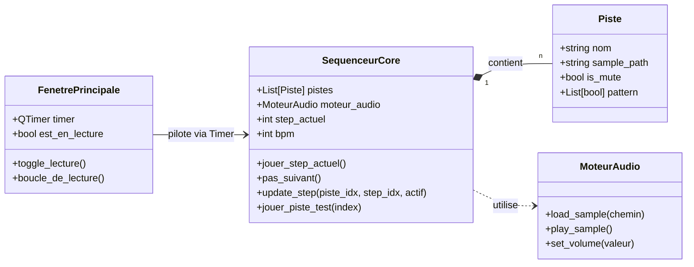

```mermaid

classDiagram
    direction LR

    class FenetrePrincipale {
        +QTimer timer
        +bool est_en_lecture
        +toggle_lecture()
        +boucle_de_lecture()
    }

    class SequenceurCore {
        +List[Piste] pistes
        +MoteurAudio moteur_audio
        +int step_actuel
        +int bpm
        +jouer_step_actuel()
        +pas_suivant()
        +update_step(piste_idx, step_idx, actif)
        +jouer_piste_test(index)
    }

    class Piste {
        +string nom
        +string sample_path
        +bool is_mute
        +List[bool] pattern
    }

    class MoteurAudio {
        +load_sample(chemin)
        +play_sample()
        +set_volume(valeur)
    }

    FenetrePrincipale --> SequenceurCore : pilote via Timer
    SequenceurCore "1" *-- "n" Piste : contient
    SequenceurCore ..> MoteurAudio : utilise

```