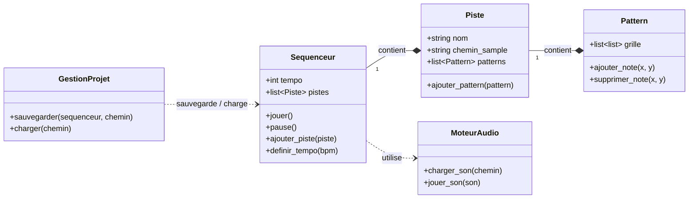

```mermaid

classDiagram
    direction LR

    class Sequenceur {
        +int tempo
        +list~Piste~ pistes
        +jouer()
        +pause()
        +ajouter_piste(piste)
        +definir_tempo(bpm)
    }

    class Piste {
        +string nom
        +string chemin_sample
        +list~Pattern~ patterns
        +ajouter_pattern(pattern)
    }

    class Pattern {
        +list~list~ grille
        +ajouter_note(x, y)
        +supprimer_note(x, y)
    }

    class MoteurAudio {
        +charger_son(chemin)
        +jouer_son(son)
    }

    class GestionProjet {
        +sauvegarder(sequenceur, chemin)
        +charger(chemin)
    }

    Sequenceur "1" --* " " Piste : contient
    Piste "1" --* " " Pattern : contient
    Sequenceur ..> MoteurAudio : utilise
    GestionProjet ..> Sequenceur : sauvegarde / charge

```